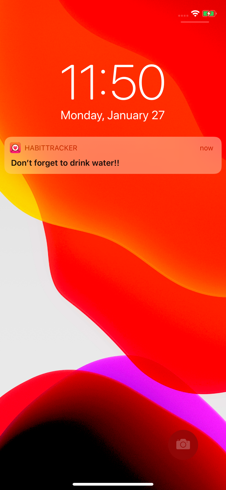

# Habit Tracker
A habit tracking app build using SwiftUI.
> require iOS 13.2 or greater, works on iPhone

## Features
- Can add habit with name, a short desc, and type as to build or quit.
- Add reminders when creating habit, or you can change later on.
- View detail by tapping on habit card.
- Detail contains success rate, streaks, reminders, and about your consistency.
- Portrait and landscape right and left supported.

## Demo
> Demo of app

> notification screenshot

## Todo
- [ ] Migrate to core data from current User Defaults

- [ ] Add calendar view for completed days

- [ ] Improve UI of detail page, currently using form.